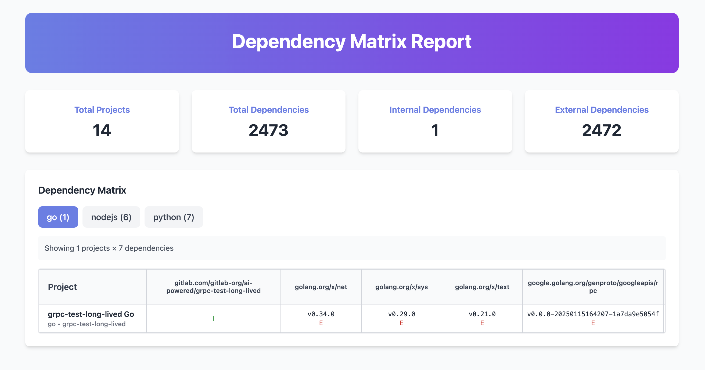

# Dependency Matrix CLI Tool

*Generate an interactive dependency matrix across multiple GitLab repositories with multi-language support.*

---

## Overview

The Dependency Matrix CLI Tool helps teams analyze dependencies across multiple GitLab repositories, supporting **monorepos** and **multi-language projects**. It produces an **interactive HTML report** that makes it easy to review internal vs external dependencies, detect outdated libraries, and simplify audits.

### Key Use Cases

- 🔍 Identify outdated or vulnerable dependencies across teams.
- 🛡️ Distinguish internal vs external libraries for security audits.
- 🧩 Analyze monorepos with mixed project types automatically.
- 📊 Generate interactive dependency matrices for CI/CD pipelines.

---



---

## Features

- 🔗 **GitLab Integration** – fetch projects and files using the GitLab API.
- 🌍 **Multi-language Support** – Go, Java, Node.js, Python.
- 🧩 **Monorepo Handling** – recursive discovery of multiple project types.
- 📊 **Interactive HTML Matrix** – filter, explore, and export results.
- 🛡️ **Dependency Classification** – internal, external, and system categorization.


---

## Supported Languages & Files

| Language | Supported Files                                                     | Parser Source                            |
| -------- | ------------------------------------------------------------------- | ---------------------------------------- |
| Go       | `go.mod`, `go.sum`                                                  | `trivy/pkg/dependency/parser/golang/mod` |
| Java     | `pom.xml`, `build.gradle`, `gradle.lockfile`                        | `trivy/pkg/dependency/parser/java`       |
| Node.js  | `package.json`, `package-lock.json`, `yarn.lock`                    | `trivy/pkg/dependency/parser/nodejs`     |
| Python   | `requirements.txt`, `Pipfile`, `poetry.lock`, `uv.lock`, `setup.py` | `trivy/pkg/dependency/parser/python`     |

---

## Docker Usage

The tool is available as a Docker image for easy deployment in CI/CD pipelines and containerized environments.

### Quick Start

```bash
# Build the Docker image
docker build -t di-matrix-cli:latest .

# Run analysis with mounted config file
docker run --rm -v $(pwd)/config.yaml:/app/config.yaml di-matrix-cli:latest analyze --config /app/config.yaml
```

### Using Make Commands

```bash
# Build Docker image
make docker-build

# Run tests in Docker container
make docker-test

# Run linter in Docker container
make docker-lint

# Run the application in Docker
make docker-run

# Run full CI pipeline (build, test, lint)
make docker-ci
```

### Environment Variables

The Docker container supports the same environment variables as the native binary:

```bash
# Run with environment variables
docker run --rm \
  -e GITLAB_TOKEN=your_token \
  -e GITLAB_BASE_URL=https://gitlab.example.com \
  -v $(pwd)/config.yaml:/app/config.yaml \
  di-matrix-cli:latest analyze --config /app/config.yaml
```

### CI/CD Integration

The Docker image is optimized for CI systems with:
- Multi-stage build for smaller final image
- Non-root user for security
- Cross-compilation support
- Separate test and lint stages

Example GitHub Actions workflow:
```yaml
- name: Run dependency analysis
  run: |
    docker run --rm \
      -e GITLAB_TOKEN=${{ secrets.GITLAB_TOKEN }} \
      -v $(pwd)/config.yaml:/app/config.yaml \
      di-matrix-cli:latest analyze --config /app/config.yaml
```

---
